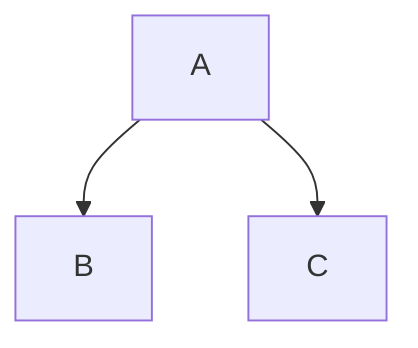

# Zenn Markdown記法リファレンス

## 見出し

```markdown
## 見出し2
### 見出し3
#### 見出し4
```

- `#`（見出し1）は記事タイトルに予約されているため、本文では`##`から使用
- アクセシビリティの観点から見出しレベルを飛ばさない（##の次は###）

## テキスト装飾

```markdown
*イタリック* または _イタリック_
**太字** または __太字__
~~打ち消し線~~
インラインの`code`
```

## リスト

### 箇条書き

```markdown
- リスト1
- リスト2
  - ネストしたリスト
```

または`*`を使用。

### 番号付きリスト

```markdown
1. 番号付きリスト1
2. 番号付きリスト2
```

## リンク

```markdown
[アンカーテキスト](URL)
```

## 画像

```markdown

```

### 画像サイズ指定

```markdown

```

幅のみ指定可能（例：`=250x`で幅250px）。

### キャプション

```markdown

*キャプションテキスト*
```

画像の直後に`*キャプション*`を記述するとキャプションが表示される。

## テーブル

```markdown
| Head | Head | Head |
| ---- | ---- | ---- |
| Text | Text | Text |
| Text | Text | Text |
```

## コードブロック

### 基本

````markdown
```言語名
コード
```
````

### ファイル名表示

````markdown
```js:ファイル名.js
const hello = "world";
```
````

言語名の後に`:ファイル名`を追加するとファイル名が表示される。

### 差分表示

````markdown
```diff js
- const hello = "world";
+ const hello = "Zenn";
```
````

`diff`と言語名をスペースで区切る。

## 数式（KaTeX）

### ブロック数式

```markdown
$$
e^{i\theta} = \cos\theta + i\sin\theta
$$
```

### インライン数式

```markdown
$a \ne 0$
```

## 引用

```markdown
> 引用文
> 複数行の引用
```

## 注釈（脚注）

```markdown
本文の参照[^1]

[^1]: 脚注の内容
```

## 区切り線

```markdown
---
```

または`***`、`___`。

## Zenn独自記法

### メッセージ

```markdown
:::message
メッセージ内容
:::
```

### 警告メッセージ

```markdown
:::message alert
警告メッセージ
:::
```

### アコーディオン（折りたたみ）

```markdown
:::details タイトル
折りたたまれる内容
:::
```

## 外部コンテンツの埋め込み

URLを単独行に貼り付けることで自動埋め込みされる。

### 対応サービス

- **YouTube**: `https://www.youtube.com/watch?v=VIDEO_ID`
- **Twitter/X**: ツイートURL
- **GitHub**: リポジトリ、Gist URL
- **CodePen**: ペンURL
- **SlideShare**: プレゼンURL
- **SpeakerDeck**: プレゼンURL
- **JSFiddle**: フィドルURL
- **CodeSandbox**: サンドボックスURL
- **Figma**: デザインURL

### Zenn内リンクカード

```markdown
https://zenn.dev/zenn/articles/markdown-guide
```

### GitHubのソースコード埋め込み

```markdown
https://github.com/owner/repo/blob/branch/path/to/file.js#L1-L10
```

行番号指定（`#L1-L10`）も可能。

## ダイアグラム（Mermaid）

````markdown

````

### 制限事項

- クリックイベントは無効
- 最大2000文字
- 最大10チェーン

## よくある記法ミス

1. **見出しの前にスペースがない**: 見出しの前には空行を入れる
2. **リストのネストが不正**: インデントはスペース2個または4個で統一
3. **コードブロックの言語指定忘れ**: シンタックスハイライトのため言語を指定
4. **画像のalt属性が空**: アクセシビリティのため適切なaltを設定
5. **独自記法の閉じ忘れ**: `:::`で必ず閉じる
6. **埋め込みURLが単独行でない**: URLの前後に他のテキストがあると埋め込まれない
