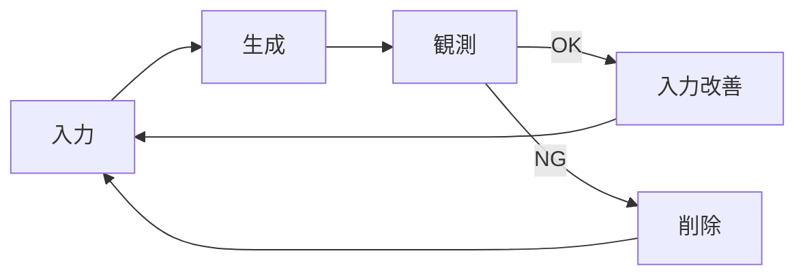

Claude Codeの会話をしていると、YOLOをデフォルトで進める人と、YOLOを必要なタイミングで使う人で、思考の前提そのものがまったく違うことに気づきました。

私は **YOLOデフォルト派** です。

**私はコードを書きたくない。**
**YOLOは前提であり、出力は観測対象である。**

という思考を前提に開発しています。

この記事では、Claude Codeを使った **「コードを書かない開発」** について、答えなき考えを徒然書いていきます。

---

## 「コードを書かない」とはどういうことか

最初に誤解を防ぐために定義しておきます。

ここで言う「コードを書かない」とは、

- 人間がコードを直接書かない。
- 人間がコードを修正しない。

という意味です。

- 品質を犠牲にする
- レビューをしない
- コードを把握しない

ということではなく、品質を犠牲にせず、コードの把握も一定割合を目指します。（私は7割程度を目指しています）

コードの把握割合については、kenn さんのツイートも参考にしてください。
https://x.com/kenn/status/1930570459155939371?s=20

私がやるのは、次のことです。

- 入力指示を与えてプランを書き、プランに基づき実装させる
- なぜこのコードになったのかを**観測**する
- どの入力（コンテキスト）が原因だったかを**特定**する
- 入力側（プラン・コマンド・スキル）を**更新**する

**コードはAIが書き、人間は入力（コンテキスト）を充実させる。**

これが基本方針です。

---

## 単発の出力は、思った通りでなくていい

ぶっちゃけ、単発の出力が自分の思った通りにならなくても問題ありません。

たとえば、こんな指示を出したとします。

```text
ユーザー情報を取得する関数を作って
```

期待していたのは `fetchUserData()` だったのに、出力されたのはこれ。

```typescript
// 出力されたコード
async function getUserInfo(userId: string): Promise<User> {
  const response = await api.get(`/users/${userId}`);
  return response.data;
}
```

`fetch` じゃなくて `get`。`Data` じゃなくて `Info`。

私はこれを直さず、コードの修正指示を出さないことも多くあります。
設計に関わるようなコードは破棄したりもしますが、これくらいのズレならそのまま受け入れます。

なぜなら、そのズレは失敗ではなく、**観測データ**だからです。

---

## ズレたら、理由を聞く

その場で、こう質問します。

```text
なぜ getUserInfo という命名にしたの？
このプロジェクトでは fetch + Data の命名規則を使っているはずだけど。
```

すると、こんな答えが返ってきます。

```text
申し訳ありません。命名規則について確認したところ、
CLAUDE.md や Rules に明示的な命名規則の記載が見当たりませんでした。

一般的な慣習として getUserInfo を採用しましたが、
プロジェクト固有の規則があれば従います。
```

**「見えていなかった」** ということがわかりました。

他にも、よくある回答パターンはこうです。

- 「そもそもルールが定義されていなかった」
- 「曖昧すぎて適用できなかった」
- 「他の指示と優先度で負けた」
- 「形式が弱く、ルールとして認識されていなかった」

:::message
「ズレたら、理由を聞く」についても、自分はコマンドとして用意しています。ここでは省略します。メタコマンド・メタスキルの実践の話は、要望あれば別の記事に書くのでよければフォローよろしくお願いします。
:::

---

## 直すのはコードではなく、入力である

ここが一番重要なポイントです。

**私は、コードを直しません。**
**直すのは、常に入力です。**

さっきの例なら、`getUserInfo` を `fetchUserData` に書き換えるのではなく、plans.md に命名規則を追記させます。(CLAUDE.md や Rules に追記される時もあります)

```markdown:plans.md
## 命名規則

### 関数名
- データ取得: `fetch` + `対象` + `Data` (例: `fetchUserData`, `fetchOrderData`)
- データ更新: `update` + `対象` (例: `updateUser`, `updateOrder`)
- データ削除: `delete` + `対象` (例: `deleteUser`, `deleteOrder`)
```

plans.md を更新したら、もう一度同じ指示を出します。

```text
ユーザー情報を取得する関数を作って
```

今度は `fetchUserData()` が出力されるはずです。

つまり、

> **出力を改善するのではなく、出力が生まれる理由を改善する**

という考え方です。

---

## なぜYOLOデフォルトなのか

YOLOというと、無計画・危険という印象を持たれがちですが、私にとってのYOLOは違います。

> **YOLOは「雑に出して、観測して、入力を更新する」学習ループを高速に回すためのモード**

設計もYOLO。
コード生成もYOLO。
コマンド生成もYOLO。

ただし、**人間はコードを書かない。**

---

## なぜ全工程でYOLOできるのか

理由はシンプルです。

- 出力はすべて捨てられる
- コードはいつでも削除できる
- コンテキストは更新できる
- 失敗しても戻れる

**可逆性が担保されている**

YOLOとは、無謀さではなく、**可逆性を前提にした設計**です。

---

## フローではなく、ループで考える

私の開発は、フェーズ分割されていません。

あるのは、このループだけです。

1. YOLOでコードを生成させる
2. 出力のズレを観測する
3. なぜズレたかを質問する
4. 設計書（plans.md）・コマンド・スキルを更新する
5. また生成させる

これは工程ではなく、**学習ループ**です。


YOLOモードだからこそ、このループを高速に回せます。

---

## 同じ設計書を、何度も使う理由

私は設計書（plans.md）を何度も書き換え、何度も使います。

- 再現できるかを試す
- 出力のブレを観測する
- 設計の弱点を炙り出す

検証が済んだ設計書は、スキルやコマンドに変換させます。

設計書は使い捨てではなく、**再利用可能な資産**です。

---

## 設計書は、コマンドに変換される

設計書から、command / skill / subagent を切り出させるのは難しくありません。

たとえば、APIエンドポイントを作る設計書があるとします。

```markdown:docs/api-design.md
## エンドポイント設計

### POST /api/users
- バリデーション: zod スキーマを使用
- レスポンス: 201 Created + User オブジェクト
- エラー: 400 Bad Request + エラー詳細
- テスト: 正常系・異常系を必ず書く
```

これをコマンドに変換させます。

```markdown:.claude/commands/create-api.md
---
description: APIエンドポイントを作成する
argument-hint: <endpoint-path>
---

以下の手順でAPIエンドポイントを作成してください。

1. docs/api-design.md から $ARGUMENTS のエンドポイント仕様を読む
2. zod スキーマを src/schemas/ に作成
3. ハンドラーを src/handlers/ に作成
4. ルーティングを src/routes.ts に追加
5. テストを tests/api/ に作成
6. テストを実行して通ることを確認
```

これで、毎回の指示が1行になります。

```text
/create-api /api/users
```

良い設計書を1つ作らせる。
そこからすべてを派生させ、コンテキストを充実させることができます。

:::message
設計書からコマンドへの変換も、メタコマンドとして用意しておくと便利です。
:::

---

## 設計者の代わりに、コマンドを酷使する

次の段階では、plans の代わりに **コマンドが働く**ようになります。

- この入力で再現できるか
- 想定外のケースはないか
- 何度実行しても同じ結果になるか

これを、ひたすら繰り返す。

---

## コードは、削除してもいい

当然、一発でうまくいくことはありません。

だから私は、

- コードを丸ごと削除する
- 少し良さそうなら stash する

```bash
# よくやる操作
git checkout .          # 全部捨てる
git stash               # 一旦退避
```

**コードは、残すためではなく、学ぶために生成するもの**という意識を持つことが重要です。

あまりにもダメな時は、コードを削除して最初からやり直すこともよくあります。自分で手入れをしたコードはサンクコストが働きますが、YOLOモードでは気軽に捨てられます。



このサイクルを高速に回すことで、入力の精度が上がっていきます。

---

## まとめ：私はコードを書かない

- 単発の出力はズレていい
- ズレは失敗ではなく観測
- 直すのはコードではなく入力
- YOLOは常に前提
- 人間は設計と観測に集中する

**私はコードを書かない。**
**書くのは、コードが生まれる理由だけだ。**

Claude Codeを使い込むほど、この開発スタイルは自然になっていきます。

---

## 補足：この開発スタイルへのよくある質問

:::details Q. 本当にコードを一切触らないの？
A. 原則として触りません。ただし、緊急のホットフィックスや、AIが明らかに理解できない微細な修正（例：typoの1文字修正）は例外です。重要なのは「コードを直すこと」をデフォルトの行動にしないことです。
:::

:::details Q. レビューしないで品質は大丈夫？
A. レビューは「出力を直すため」ではなく「入力を改善するため」に行います。コードの問題を見つけたら、その問題が生まれた原因（指示の曖昧さ、ルールの不足など）を特定し、入力側を修正します。出力は、仕様を満たしていたらOKと割り切っています。
:::

:::details Q. YOLOで怖くない？
A. devcontainer を利用しましょう。長時間セッションで走らせる場合や、`rm` が伴うコマンドを利用する可能性がある場合は特に有効です。コンテナ内で作業すれば、最悪の場合でもコンテナを破棄して再構築するだけで済みます。本番デプロイには当然、通常のCI/CDパイプラインを通します。
:::

:::details Q. 時間がかかるんだけど。
A. 最初は時間がかかるかもしれません。しかし、入力資産（設計書・コマンド・スキル）が充実してくると、同じ作業を繰り返すたびに時間が短縮されていきます。最終的には、手動でコードを書くよりも速く、高品質なコードが得られるようになります。
ただし、期限が迫っている時、重大なバグやセキュリティ問題がある場合は、直接修正指示を出すことも多々あります。
:::

:::details Q. この方法は全員に向いている？
A. 向き不向きはあると思います。「コードを書くこと自体が楽しい」人には合わないかもしれません。一方で「問題を解決すること」にフォーカスしたい人、設計や仕組み作りが好きな人には自然にフィットするはずです。
:::
